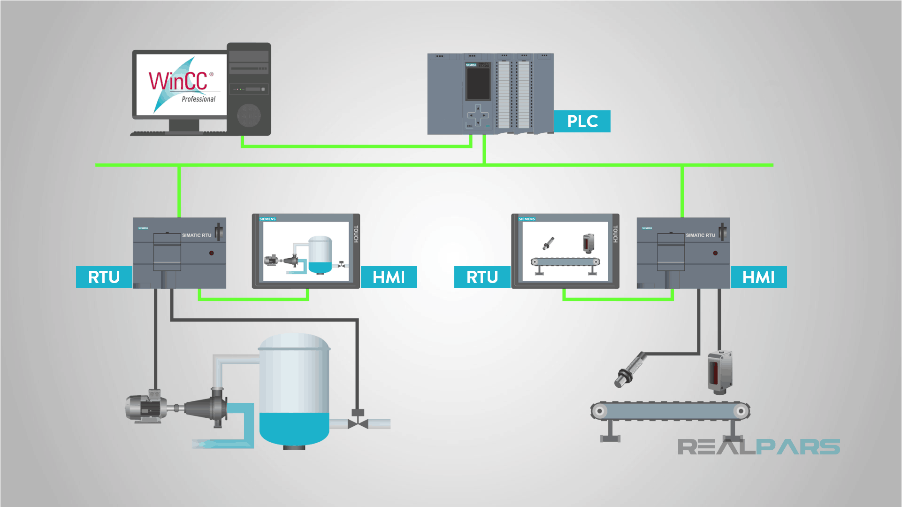
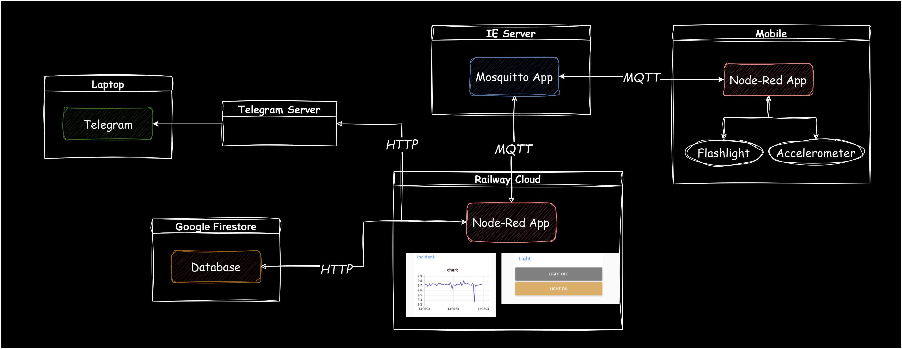

# Production Supporting Systems in Factories

## ระบบสนับสนุนการผลิตในโรงงานอุตสาหกรรม

---

# Topic

- อุปกรณ์ตรวจวัดอัจฉริยะ
- ระบบสารสนเทศ
- **Industrial Control System (ICS)**
  - SCADA (Supervisory control and data acquisition)
  - DCS (Distributed control systems)

---

# SCADA

Supervisory control and data acquisition

---

# SCADA

- A system of software and hardware elements that allows industrial organizations to:
  - **Control** industrial processes locally or at remote locations
  - Directly **interact** with devices such as sensors, valves, pumps, motors, and more through human-machine interface (HMI) software
  - **Monitor**, gather, and process real-time data
  - **Record** events into a permanent storage.

---

# Architecture

- **PLC** (Programmable Logic Controller) and/or **RTU** (Remote Terminal Units)
- **HMI** (Human Machine Interface)
- **Field devices** - sensors and actuators
- **SCADA computer**

---

# We will come back to this topic later.

- Now, let's learn about a control system by making a DIY "SCADA".

---

# Project Demo

[Link](https://cmu.to/prodsup-demo-ui)

---

# Diagram

## 

---

# Components

- `Node-Red App` running on a cloud server (Railway Cloud)
  - Collect sensor data
  - Displaying sensor data
  - Notifying operator of the incident through `Telegram App` (Laptop)
  - Writing and reading from `Database` (on Google Firestore)

---

# Components (cont)

- `Node-Red App` runnign on mobile
  - Receive command to toogle a `flashlight`
  - Process and send `accelerometer` data
- `Mosquitto App` running on a cloud server (IE Server)
  - Receiving and broadcasting data from and to both `Node-Red App`.

---

# Protocol

- HTTP (Hypertext Transfer Protocol)
  - Basically the "internet" protocol
- MQTT
  - Leading open source protocol for connecting internet of things (IoT) and **industrial IoT (IIoT)** devices.

---

# Comparison to SCADA components

| Component            | Function             | SCADA Equiv.   |
| -------------------- | -------------------- | -------------- |
| `Node-Red` (Railway) | Collect data         | PLC / RTU      |
|                      | Display data         | SCADA computer |
|                      | Notify to `Telegram` | SCADA computer |
|                      | Write to `Database`  | SCADA computer |

---

# Comparison to SCADA components

| Component           | Function             | SCADA Equiv. |
| ------------------- | -------------------- | ------------ |
| `Node-Red` (Mobile) | Control sensors      | PLC / RTU    |
| `Accelerometer`     | Measure acceleration | Sensor       |
| `Flashlight`        | Light                | Actuator     |
