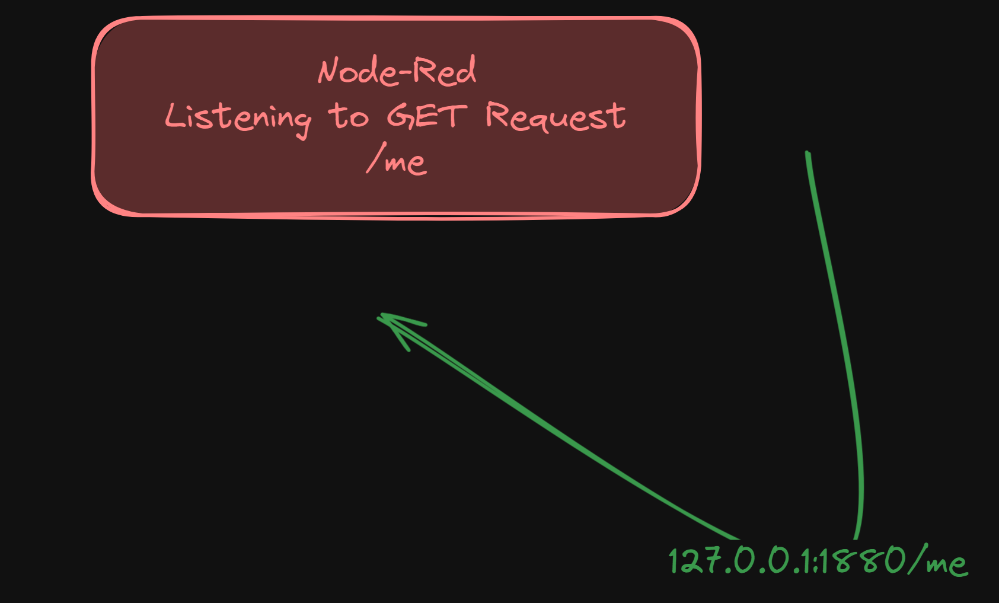
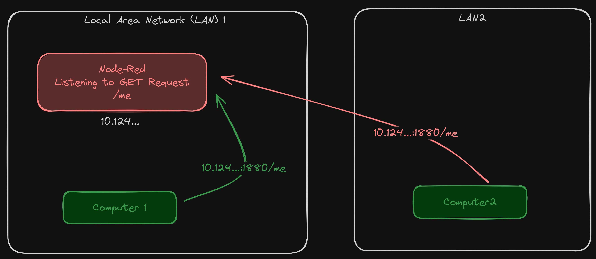
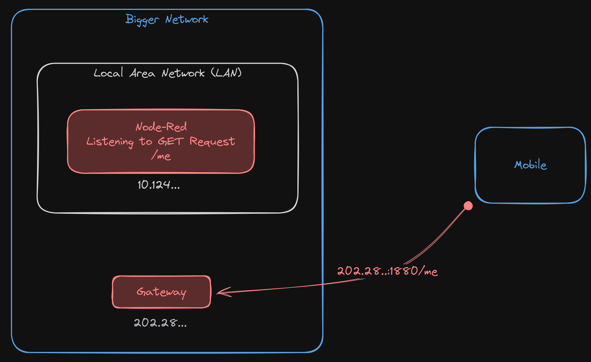
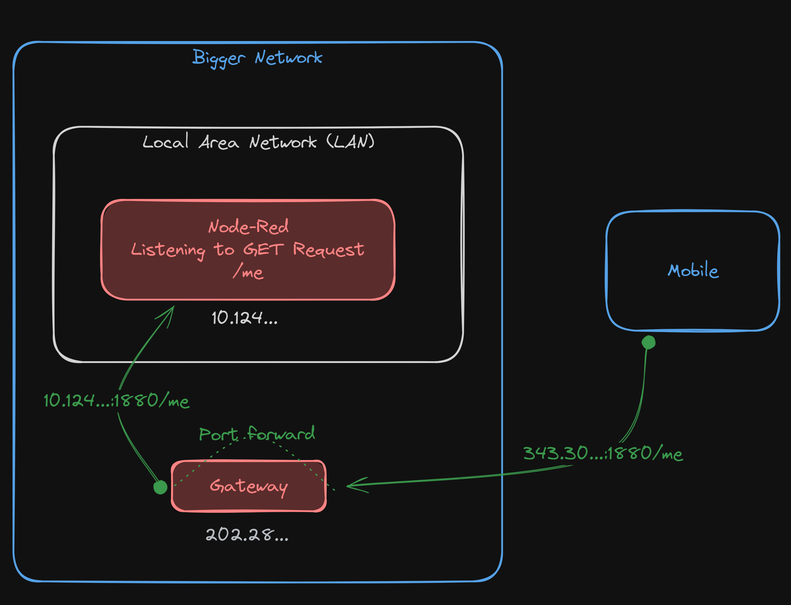
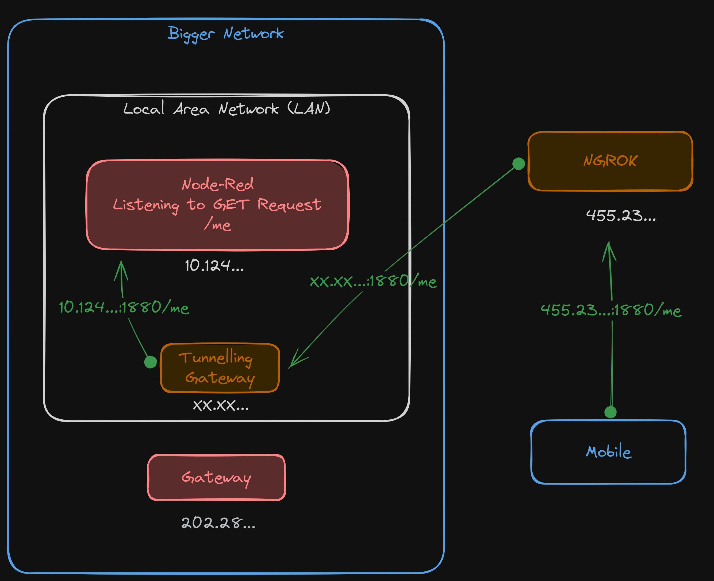

<style>
@import url('https://fonts.googleapis.com/css2?family=Prompt:ital,wght@0,100;0,300;0,400;0,700;1,100;1,300;1,400;1,700&display=swap');

    :root {
    font-family: Prompt;
    --hl-color: #D57E7E;
}
h1 {
  font-family: Prompt
}
</style>

# Production Supporting Systems in Factories

## ระบบสนับสนุนการผลิตในโรงงานอุตสาหกรรม

---

# HTTP `Get` Request

- Send a `get` request to `http://google.com`.
- Display a response to a `debug` panel.
- Write a response to `index.html`

---

# HTTP Server

- Create a server that responds to the `GET` request to `/hello`.
  - Respond with a static string.
  - Respond with a dynamic string.

```javascript
const date = new Date();
msg.time = date.toLocaleTimeString();
return msg;
```

---

- Reponse to `/home` with an HTML document.
  - Create flow `http in`, `read file`, `http response`, `debug`


---

- `http in` node

  - `Method` = `GET`
  - `URL` = `home`

- `http response` node
  - No need to do anything.

---

- `read file` node
  - `Filename` = `html/index.html`
  - See next page.


---

- Create a folder `html`
- Place an `index.html` in the folder
- Use web browser to the url `/home`

---

# Check your friends' computer

- Disable your firewall.
- Open `powershell` and type `ipconfig`
- Check if your friends' IP address is in the same subnet as your computer's
  - [Subnet calculator](https://www.solarwinds.com/free-tools/advanced-subnet-calculator)
- Test your friends' computer by typing `test-netconnection 10.10.x.x -port 1880`
- If passed, the url is `http://10.10.x.x:1880/home`

---

# Networking overview

---

# Localhost



---

# Local area network



---

# Public IP



---

# Port forwarding



---

# Local tunneling



---

- Get `ngrok`
  - Create an account at https://ngrok.com/
  - **Verify email.**
  - Download the program.
  - Extract the program to the project folder.
  - Copy the command below.


---

- `VSCode`
  - Create `New Terminal`
  - Run `ngrok config add-authtoken <YOUR AUTHTOKEN>` (Remove `./` from what you just copied.)
  - Run `ngrok http 1880`
- Copy the `https` address (`ctrl` + `shift` + `c`)


---

- Paste the address in the browser.
  - Don't forget to add the url in the end.

## 

- Try sharing this link to your friends.
