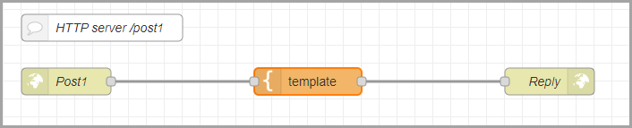

<style>
@import url('https://fonts.googleapis.com/css2?family=Prompt:ital,wght@0,100;0,300;0,400;0,700;1,100;1,300;1,400;1,700&display=swap');

    :root {
    font-family: Prompt;
    --hl-color: #D57E7E;
}
h1 {
  font-family: Prompt
}
</style>

# Production Supporting Systems in Factories

## ระบบสนับสนุนการผลิตในโรงงานอุตสาหกรรม

---

# HTTP POST Server

---

# Server listening to `POST` requests

- Create a server that receives `POST` requests.
  - Flow



---

- `http in` node


- Send the transformed message back.
- Try sending the post requests to your friends public address.

---

- `template` node


---

- `http response` node


---

# Send `POST` request from `node-red`

---

- Create a `post` request
  - Flow


---

- `inject` node


- Note: If there is a connection error, use `http://127.0.0.1:1880/post1`
  - [What?](https://www.baeldung.com/cs/127-0-0-1-vs-localhost)

---

# Send `POST` request from another program

---

# Software

- [Postman Desktop](https://www.postman.com/downloads/)
- Chrome
  - [Talent API Tester](https://chromewebstore.google.com/detail/talend-api-tester-free-ed/aejoelaoggembcahagimdiliamlcdmfm)
- Firefox
  - [RESTClient](https://addons.mozilla.org/en-US/firefox/addon/restclient/)

---

# Serving dynamic content

---

- Create another url that response with dynamic content.
  - Flow


- `http in` node
  - `url` = `post2`

---

- `function` node


(code on the next page)

---

```javascript
const message = msg.payload;
const date = new Date();
const time = date.toLocaleTimeString();

msg.payload = `I got your message "${message}" at ${time} !`;
return msg;
```

---

- Try send in a post message to `.../post2`.
- Also you can use `ngrok` to create a public url and send POST request across the internet.
