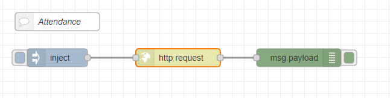
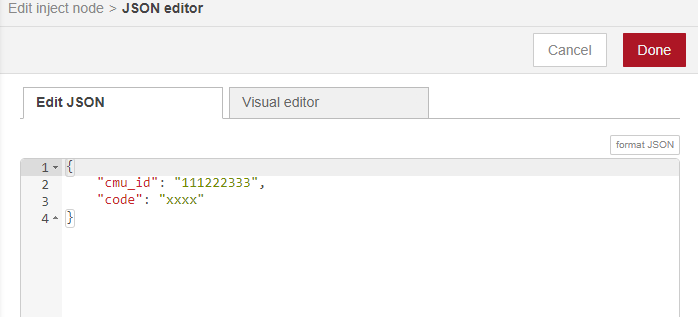
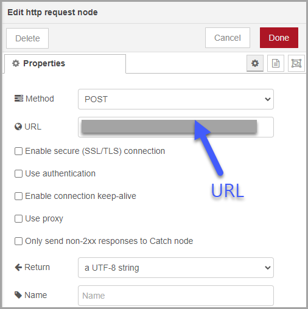

<style>
@import url('https://fonts.googleapis.com/css2?family=Prompt:ital,wght@0,100;0,300;0,400;0,700;1,100;1,300;1,400;1,700&display=swap');

    :root {
    font-family: Prompt;
    --hl-color: #D57E7E;
}
h1 {
  font-family: Prompt
}
</style>

# Production Supporting Systems in Factories

## ระบบสนับสนุนการผลิตในโรงงานอุตสาหกรรม

---

# Class Attendance

## การทำเรื่องง่ายๆให้มันยาก

---

# วิธีการเช็คชื่อ

- Send `Post` request to
  `https://materials-line-oa-production.up.railway.app/prodsup`
- Payload
  - `cmu_id`: your 9-digit student id
  - `code`: 4-character code from the screen (ไม่เอา `CODE:`)

```json
{
  "cmu_id": "111222333",
  "code": "xxxx"
}
```

---

- Flow



---

- `inject` node
  - `msg.payload`



---

- `http request` node


