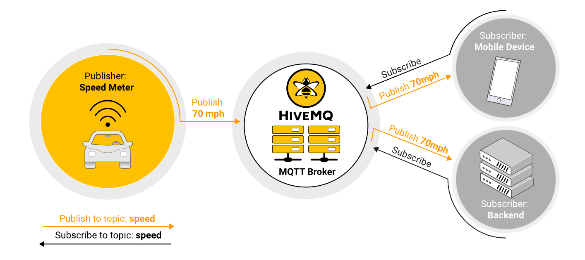
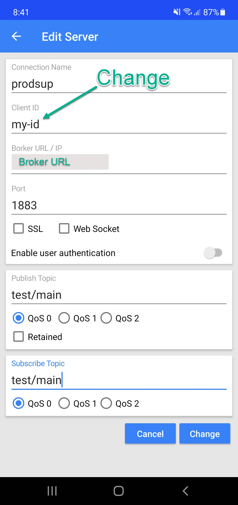
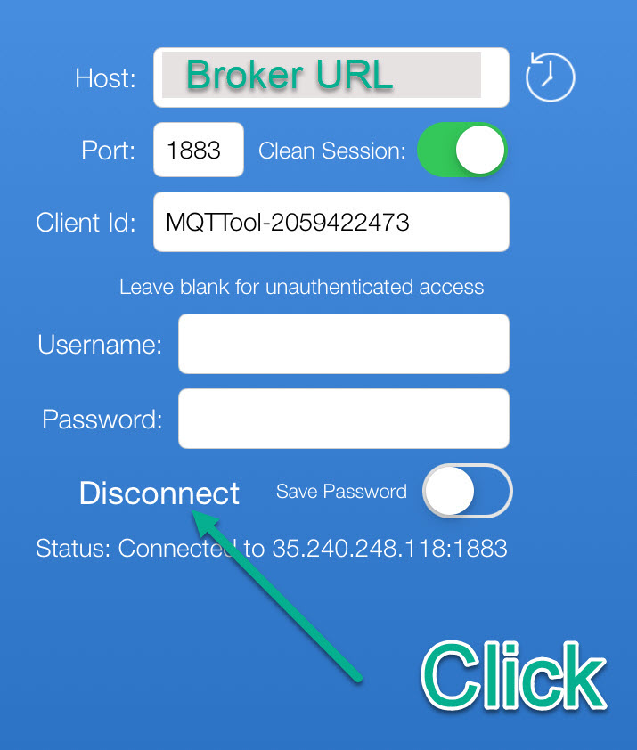
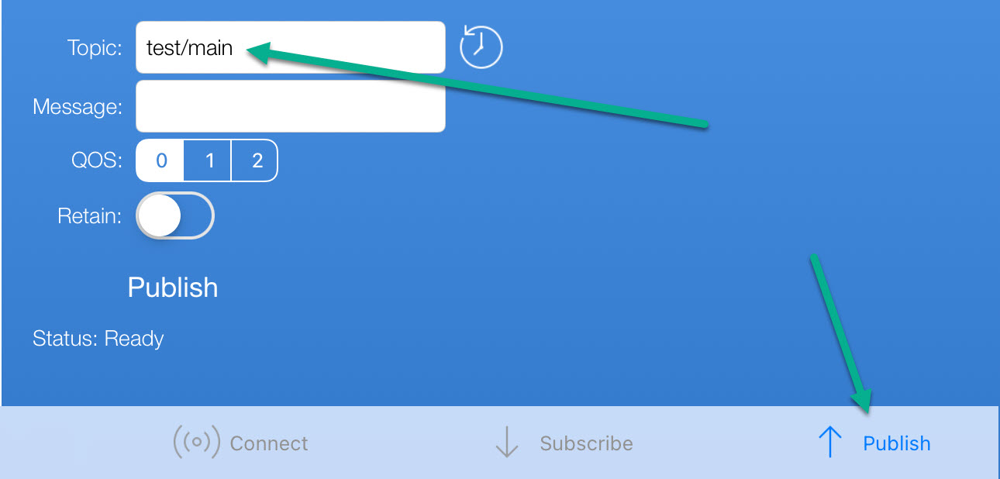
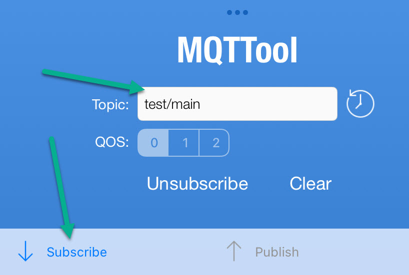
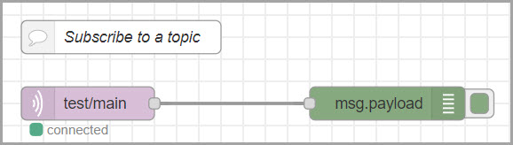
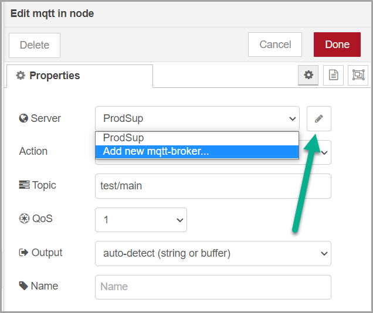
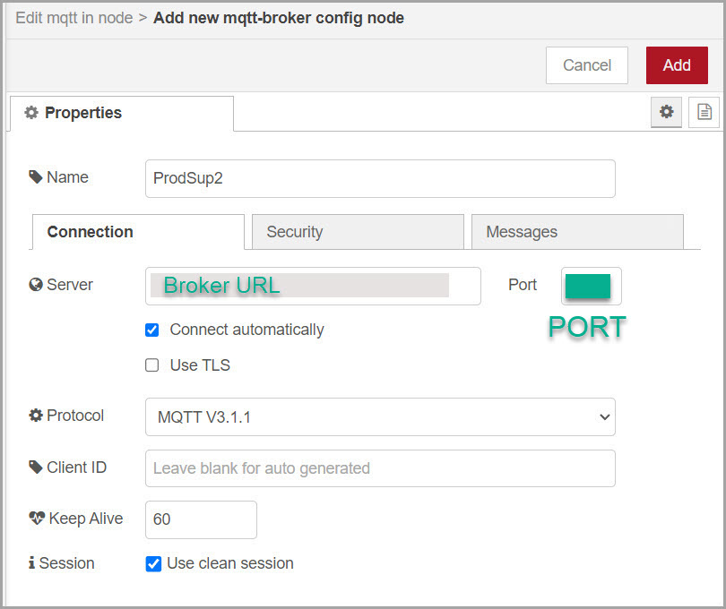
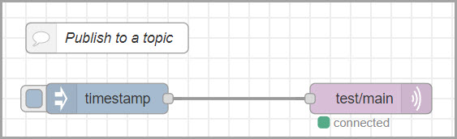
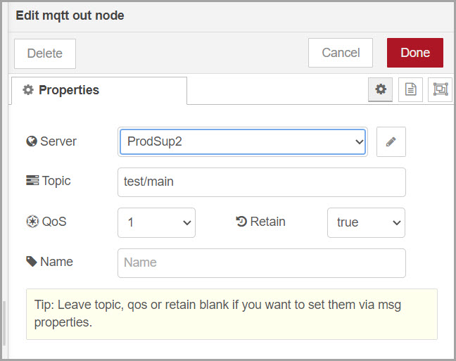

# Production Supporting Systems in Factories

## ระบบสนับสนุนการผลิตในโรงงานอุตสาหกรรม

---

# MQTT

---

# MQTT

- MQTT is a Client Server publish/subscribe messaging transport protocol.
- It is light weight, open, simple, and designed so as to be easy to implement.
- Ideal for use in many situations
  - Machine to Machine (M2M)
  - **Internet of Things (IoT)**

---

# Publish/subscribe pattern

- The publish/subscribe pattern (also known as `pub/sub`) provides an **alternative** to traditional client-server architecture.
  - In client-server architecture, a client communicates directly with an endpoint.

---

# Publishers and subscribers

- The `pub/sub` model decouples
  - a client that sends a message (the `publisher`) from
  - a client or clients that receive the messages (the `subscribers`).
- The `publishers` and `subscribers` never contact each other directly.
  - In fact, they are not even **aware that the other exists**.

---

# Broker

- The connection between `publishers` and `subscibers` is handled by a third component (the `broker`).
- The job of the broker is to filter all incoming messages and distribute them correctly to subscribers.

---

---

# Aspects of pub/sub architecture

- **Space decoupling**: Publisher and subscriber do not need to know each other (for example, no exchange of IP address and port)

- **Time decoupling**: Publisher and subscriber do not need to run at the same time.
- **Synchronization decoupling**: Operations on both components do not need to be interrupted during publishing or receiving.

---

# Topic

- `Topic` refers to an UTF-8 string that the broker uses to filter messages for each connected client.

- The topic consists of one or more topic levels. Each topic level is separated by a forward slash (topic level separator).

---

# Topic examples

- Each topic must contain at least 1 character.
  - Actually, `/` is a topic.
- Topic string permits empty spaces.
  - `USA/California/San Francisco/Silicon Valley` is a valid topic.
- Topics are case-sensitive.
  - `myhome/temperature` and `MyHome/Temperature` are two different topics.

---

- Wildcards

---

---

# Enough talk. Let's try it.

---

# MQTT Terminal (Android)

- `Broker URL/IP`: `1.tcp.ap.ngrok.io`
- `Client ID`: `อะไรก็ได้ที่ไม่ซ้ำ`
- `Port`: `25580`
- `Publish Topic`: `test/main`
- `Subscribe Topic`: `test/main`

---

# MQTTool (iOS)

- `Host`: `1.tcp.ap.ngrok.io`
- `Port`: `25580`
- `Client ID`: Leave blank

---

- `topic`: `test/main`
  

---

- `topic`: `test/main`
  

---

# Quality of service

- The Quality of Service (`QoS`) level is the guarantee of delivery for a specific message.

---

# Levels of `QoS`

- `0`: **At most once**
  - No guarantee of delivery (fire and forget)
  - Fastest
- `1`: **At least once**
  - Guarantees that a message is _delivered at least one time_ to the receiver.
  - Multiple delivery can occur.
- `2`: **Exactly once**
  - Each message is _received only once_ by the intended recipients.
  - Slowest

---

# Setting `QoS` level

There are the two sides of message delivery:

- `publishing client` ➜ `broker`
- `broker` ➜ `subscribing client`

---

# `publishing client` ➜ `broker`

- The `publishing client` defines the `QoS` level of the message.

---

# `broker` ➜ `subscribing client`

- The `broker` transmits the message to `subscribing clients` using the `QoS` level that each `subscribing client` defines during the subscription process.
- If the `subscribing client` defines a lower `QoS` than the `publishing client`
  - the broker transmits the message with the lower quality of service.

---

# General use for `QoS` level

- `0`: You don’t mind if a few messages are lost occasionally.
- `1`: You need to get every message and your use case can handle duplicates.
  - _Generally recommended._
- `2`: It is critical to your application to receive all messages exactly once.

---

# Retained message

- A retained message is a normal MQTT message with the `retained` flag set to `true`.
- The broker stores the last retained message and the corresponding QoS for that topic.
- Each client that subscsribes to a topic pattern that matches the topic of the retained message receives the retained message immediately after they subscribe.
- The broker stores only one retained message per topic.

---

# MQTT in Node-Red

---

# Subscript to a topic

- Flow
  - `mqtt in`, `debug`

---

- `mqtt in` node
  - Choose `Add new mqtt-broker...`
  - Click `edit` (Next page)
  - `Topic`: `test/main`
  - `QoS`: `1`

---

- `Server`: `1.tcp.ap.ngrok.io`
- `Port`: `25580`

---

# Publish to a topic

- Flow
  - `inject`, `mqtt out`

---

- `mqtt out`
  - `Topic`: `test/main`
  - `QoS`: `1`
  - You may choose to `Retain` message.
    
