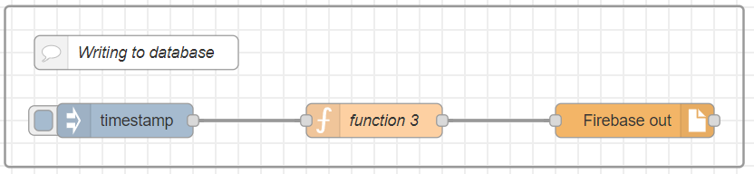
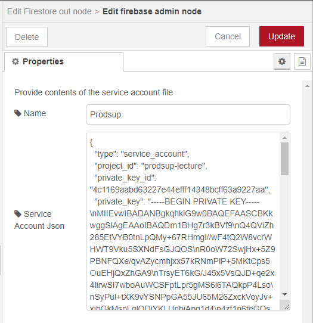
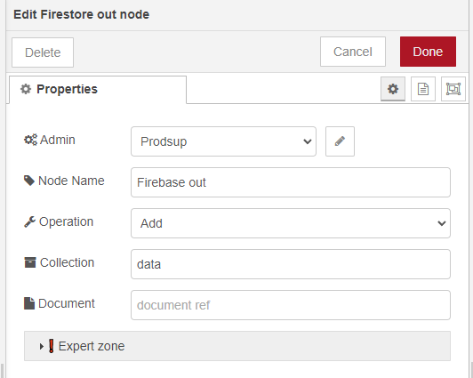
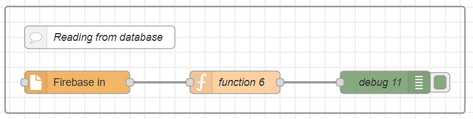
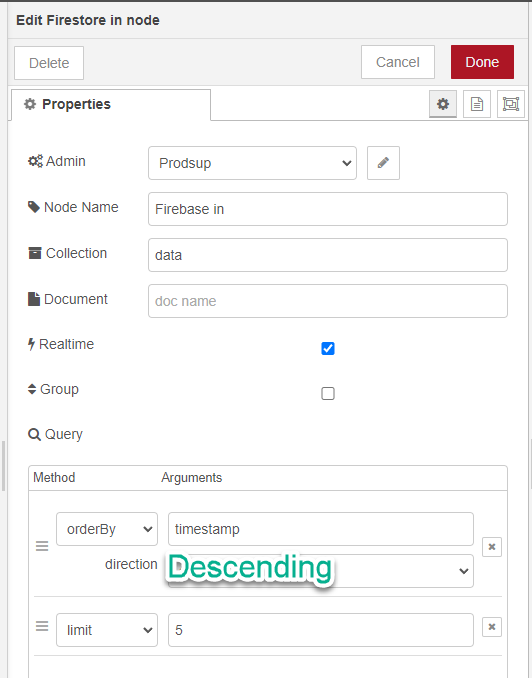

<style>
@import url('https://fonts.googleapis.com/css2?family=Prompt:ital,wght@0,100;0,300;0,400;0,700;1,100;1,300;1,400;1,700&display=swap');

    :root {
    font-family: Prompt;
    --hl-color: #D57E7E;
}
h1 {
  font-family: Prompt
}
</style>

# Production Supporting Systems in Factories

## ระบบสนับสนุนการผลิตในโรงงานอุตสาหกรรม

---

# Cloud database

---

# Setup `node-red`

- `pnpm install node-red-contrib-cloud-firestore`

---

# Setup database

- Go to [Google Firebase](https://console.firebase.google.com/).
- Create new project.
- Create `firestore database`.
- Obtain a service-account `json`.

---

# M6-1: Writing to database

---



---

# `function` node

```js
const timestamp = new Date().getTime();
const value = Math.random();
msg.payload = {
  value: value,
  timestamp: timestamp,
};
return msg;
```

---

# `firebase out` node

---

- Input service account data.



---

- Operation: `Add`
- Collection: `data`
  

---

# M6-2: Reading from database

---



---

# `firestore out` node

---

- Collection: `data`
- Realtime: `enabled`
- Query
  - OrderBy: `timestamp`
    - Direction: `descending`
  - Limit: `5`



---

# `function` node

```js
let payload = msg.payload;
let textOut = "";

for (const [key, value] of Object.entries(payload)) {
  const _date = value?.timestamp ? new Date(value.timestamp) : new Date();
  let reading = value.value;
  if (parseFloat(value.value)) {
    reading = parseFloat(value.value).toFixed(2);
  }
  const datestring = _date.toLocaleDateString();
  const timestring = _date.toLocaleTimeString();
  textOut += `📆${datestring} ⏰${timestring} ✏️${reading}<br/>`;
}

msg.payload = textOut;
return msg;
```
