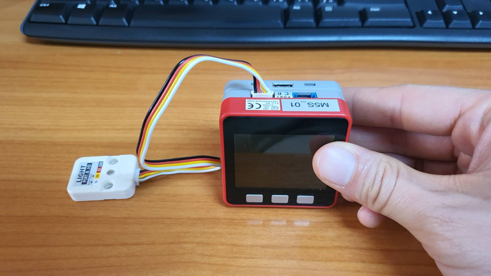
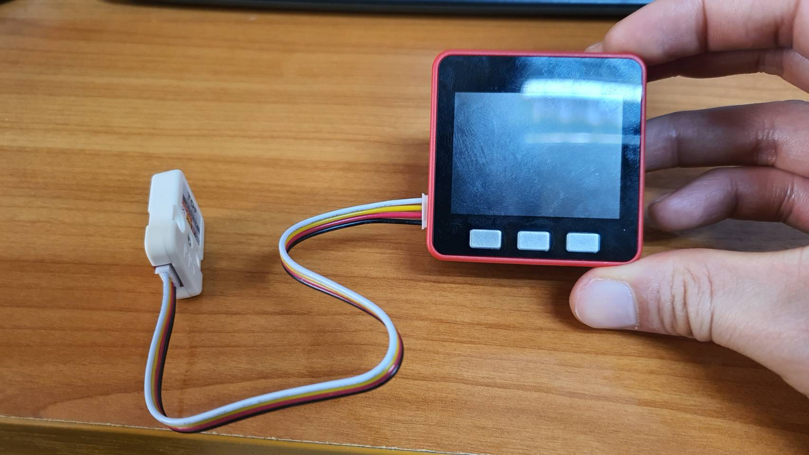

# Production Supporting Systems in Factories

## ระบบสนับสนุนการผลิตในโรงงานอุตสาหกรรม

---

# Other nodes

- `delay`
  - Delay messages
- `filter`
  - Block values unless changed.
- `timeout`
  - Install `node-red-contrib-timeout`

---

# M5Stack

---

# Connection - Light Sensor

---

# Connection - ToF Sensor

---

# MQTT Topics

- Light sensor
  - `XXXX/LightValue`
  - `XXXX/LightControl`
  - `XXXX/LightStatus`
- Time of flight sensor
  - `XXXX/ToFDistance`
  - `XXXX/AlarmControl`
  - `XXXX/AlarmStatus`

---

# Advanced debugging

- [M5Burner](https://docs.m5stack.com/en/download)
- [Code](https://o365cmu-my.sharepoint.com/:f:/g/personal/nirand_p_cmu_ac_th/EmCc5_Ew911PqJ4wAlnQPxMBhBGN3iWK3-RnS6768q8FPw?e=dYDwR9)
- [UI Flow Desktop](https://github.com/m5stack/m5-docs/blob/master/docs/en/related_documents/UIFlow_Desktop_IDE.md)
