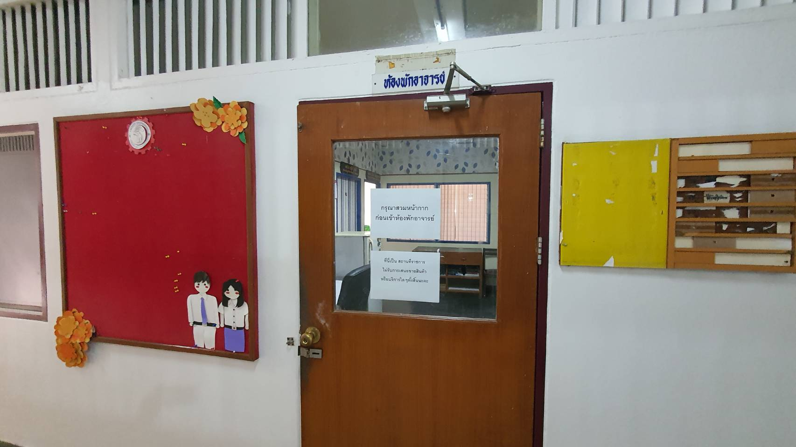

# Production Supporting Systems in Factories

## ระบบสนับสนุนการผลิตในโรงงานอุตสาหกรรม

---

# Project

---

# Previous year

- Temperature monitoring system
- Room usage monitoring system (brightness sensor)
- Light turning off with delay
- Smart secuity system (face detection)
- Clock in system: ontime or late
- Object detection: proximity sensor
- [More](https://www.youtube.com/playlist?list=PLNGLpHQhvGrtqn6UYxUYXm7C0auAYrh_O)

---

# Grade

- 20% ของเกรด
- คะแนนเต็ม 40 คะแนน
  - คะแนนโปรเจค 25 คะแนน
  - คะแนนนำเสนอ 10 คะแนน

---

# Score breakdown

| คะแนน  | เกณฑ์             | คะแนนย่อย | ตัวอย่าง                 |
| ------ | ----------------- | :-------: | ------------------------ |
| โปรเจค | Monitoring Flow   |     5     | Chart / Gauge / Text     |
|        | Notification Flow |     5     | Telegram Notify          |
|        | Control Flow      |     5     | Action Button            |
|        | Data Storage      |     5     | Firebase read/write      |
|        | Logic Design      |     5     | Overall logic complexity |

---

# Score breakdown

| คะแนน  | เกณฑ์                | คะแนนย่อย |
| ------ | -------------------- | :-------: |
| นำเสนอ | Slide                |     5     |
|        | Presenting / demoing |     5     |

- แนะนำให้อัด VDO แทนการ Demo Live

---

# Schedule

- **นำเสนอกลุ่มละไม่เกิน 10 นาที**
- Date 11-24 December 2024
- Location @ Office ของ อ.นิรันดร์
- นัดเวลา https://calendly.com/nirand-p/prodsup-presentation
  - นัด Project Meeting (11 - 18 Dec)
  - นัด Project Presentation (19 - 24 Dec)

---

# My Office

IE Build First Floor

---

# Slide

- ชื่อกลุ่ม
- ระบบมีความสามารถอะไรในหัวข้อต่อไปนี้
  - Monitoring
  - Notification
  - Control
  - Data storage
- อธิบายการทำงานของ Flow ต่างๆ
- สามารถต่อยอดไปทำอะไรในโรงงานได้
