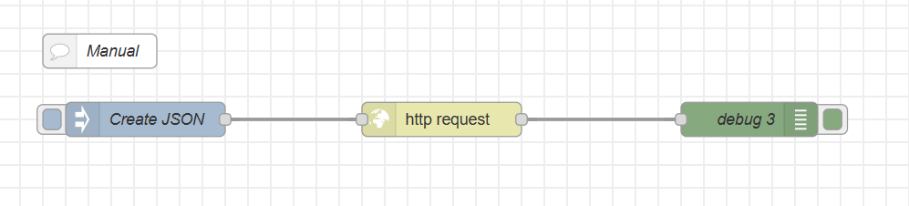
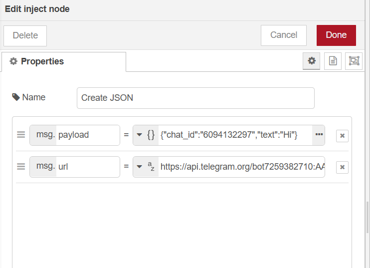
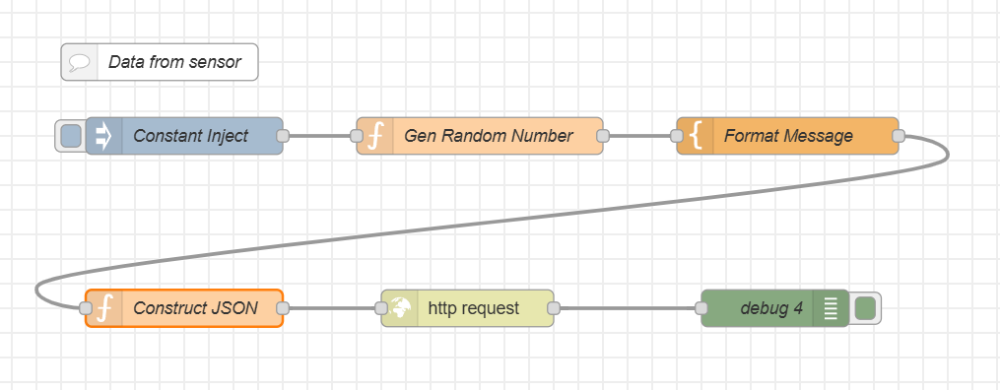

<style>
@import url('https://fonts.googleapis.com/css2?family=Prompt:ital,wght@0,100;0,300;0,400;0,700;1,100;1,300;1,400;1,700&display=swap');

    :root {
    font-family: Prompt;
    --hl-color: #D57E7E;
}
h1 {
  font-family: Prompt
}
</style>

# Production Supporting Systems in Factories

## ระบบสนับสนุนการผลิตในโรงงานอุตสาหกรรม

---

# Telegram Notify

---

# Preparation

You neeed

```
TOKEN=...
URL_NOTIFY=...
URL_GETUPDATES=...
CHAT_ID=...
```

---

# Steps (1/2)

- Sign up for telegram.
- Talk to `@BotFather`
  - Type `/newbot` to get `TOKEN`
- Construct `URL_NOTIFY`
  - From `https://api.telegram.org/bot{TOKEN}/sendMessage`

---

# Steps (2/2)

- Talk to the bot.
- Construct `URL_GETUPDATES`
  - From `https://api.telegram.org/bot{TOKEN}/getUpdates`
- Get `CHAT_ID` by visiting `URL_GETUPDATES`

---

# Flow: manual



---

# Inject node

- `payload` เป็น `json`

```
{
    "chat_id": "6094132297",
    "text": "Hi"
}
```

- `url` = `URL_NOTIFY`
  

---

# More realistic flow



---

# Get random number

- This mimics the value from a sensor.

```js
msg.payload = Math.random();
return msg;
```

---

# `Construct JSON` node

```js
// Input your info here
const TOKEN = "...";
const CHAT_ID = "...";

// Store incoming message
const value = msg.payload;

// Construct "JSON"
msg.payload = {
  chat_id: CHAT_ID,
  text: value,
};
msg.url = `https://api.telegram.org/bot${TOKEN}/sendMessage`;
return msg;
```
