<style>
@import url('https://fonts.googleapis.com/css2?family=Prompt:ital,wght@0,100;0,300;0,400;0,700;1,100;1,300;1,400;1,700&display=swap');

    :root {
    font-family: Prompt;
    --hl-color: #D57E7E;
}
h1 {
  font-family: Prompt
}
</style>

# Production Supporting Systems in Factories

## ระบบสนับสนุนการผลิตในโรงงานอุตสาหกรรม

---

# Dashboard

---

# Dashboard display

---

- Go to `Manage palette`
- Install `node-red-dashboard`

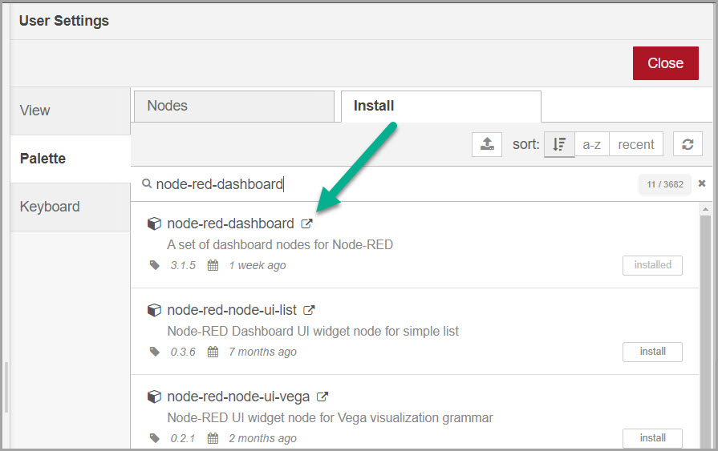

---

- Go to `Dashboard` tab
- Click `+ tab`
  - Edit tab information
- Click `+ group`
  - Edit group information
    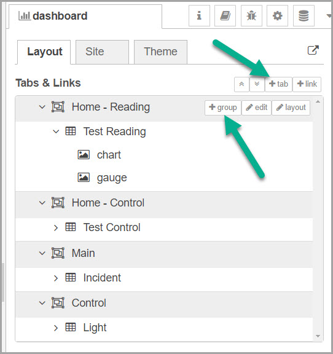

---

- Flow
  - `inject`, `function`, `chart`, `gauge`

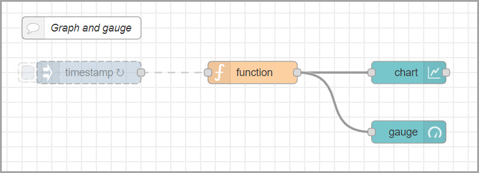

---

- `inject` node
  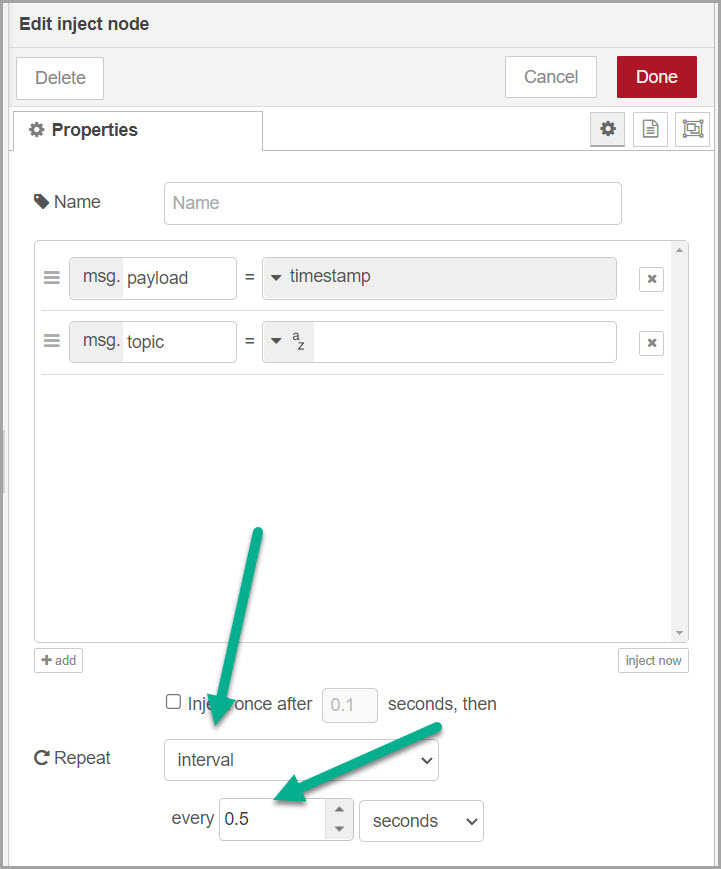

---

- `function` node (code on the next page)

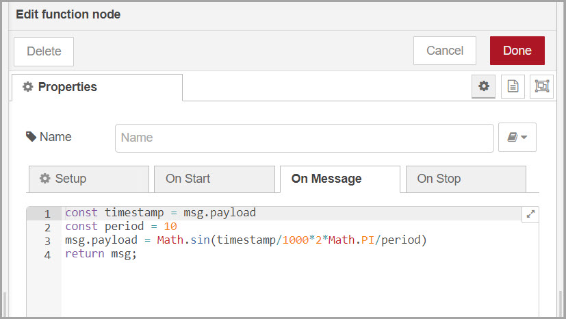

---

```javascript
const timestamp = msg.payload;
const period = 10;
msg.payload = Math.sin(((timestamp / 1000) * 2 * Math.PI) / period);
return msg;
```

---

- `chart` node
  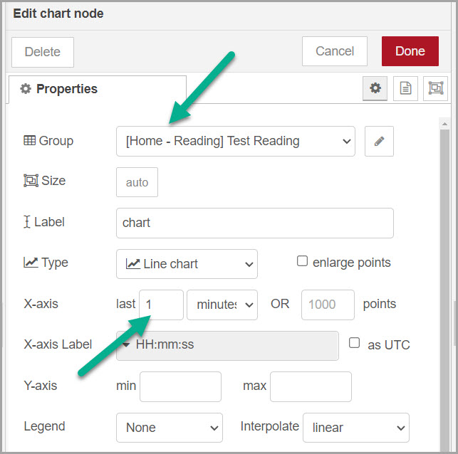

---

- `gauge` node
  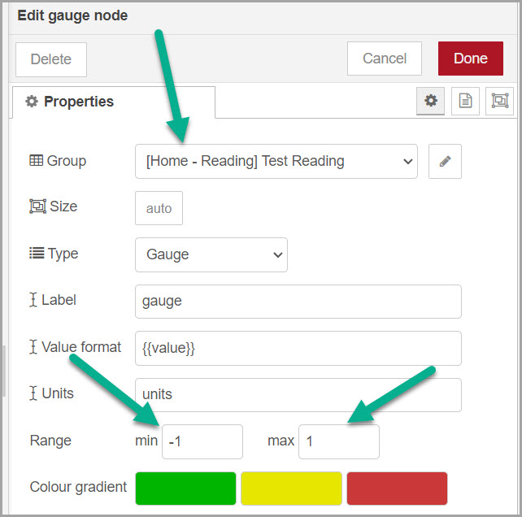

---

# Control

---

- Flow
  - `button`, `mqtt out`

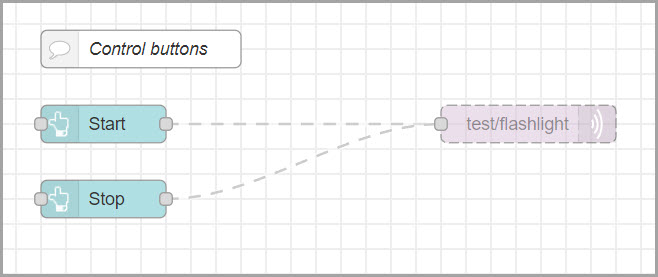

---

- `button` Start

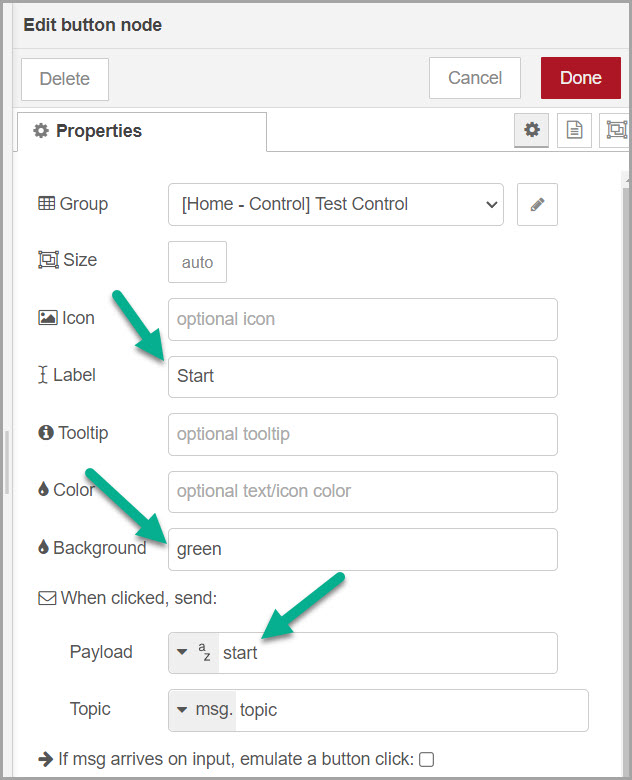

---

- `button` Stop

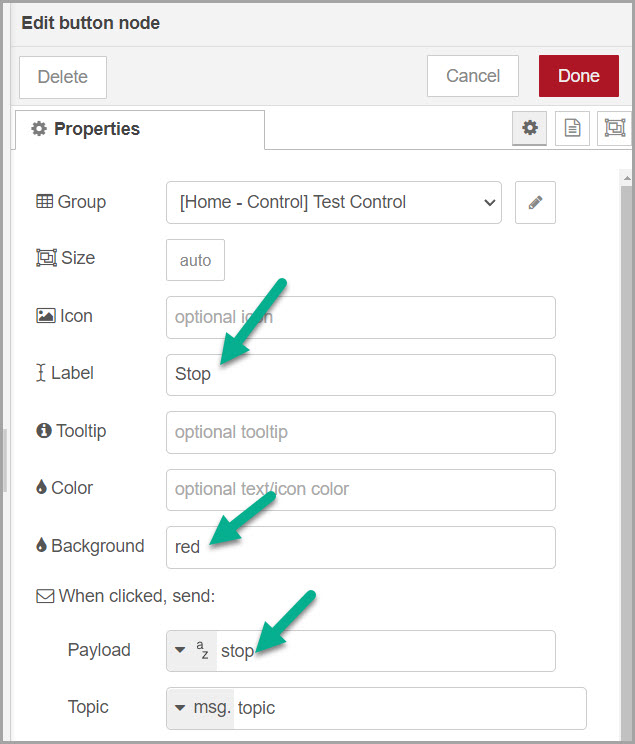

---

- `mqtt out` node

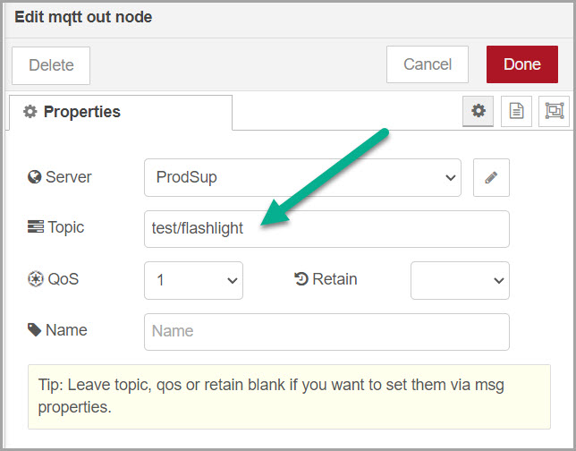

---

- flow
  - `mqtt in`, `template`, `debug`

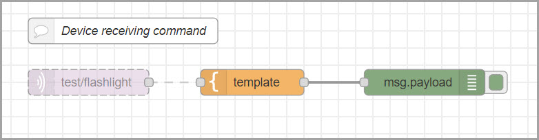

---

- `mqtt in` node

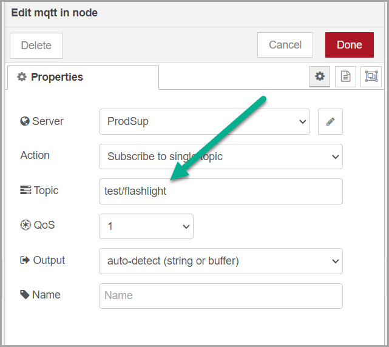

---

- `template` node

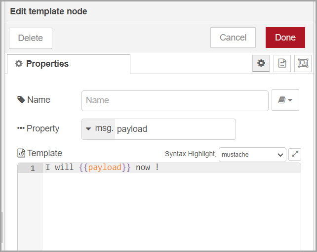
