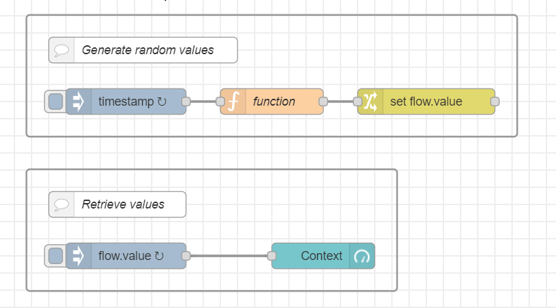
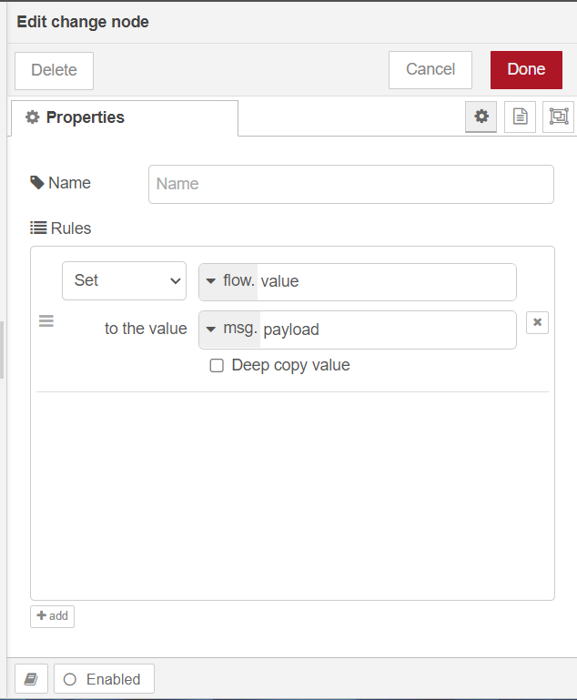
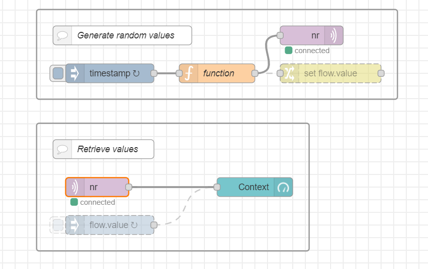
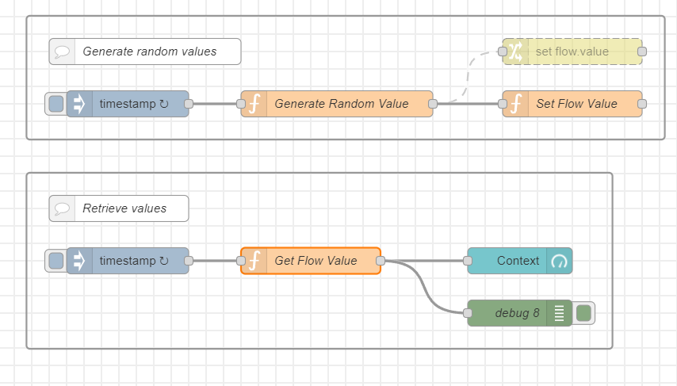
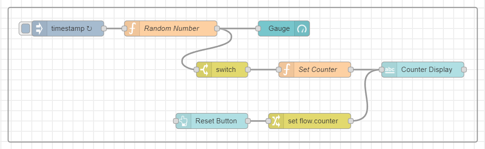
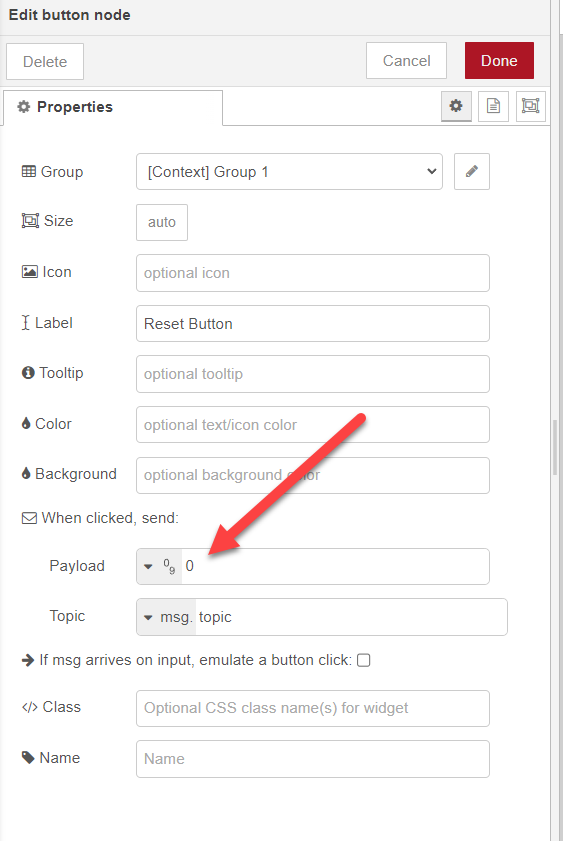
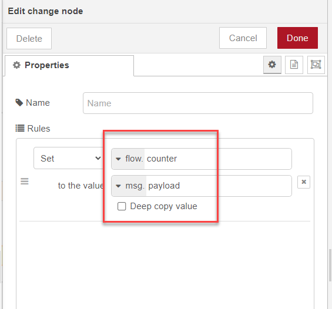
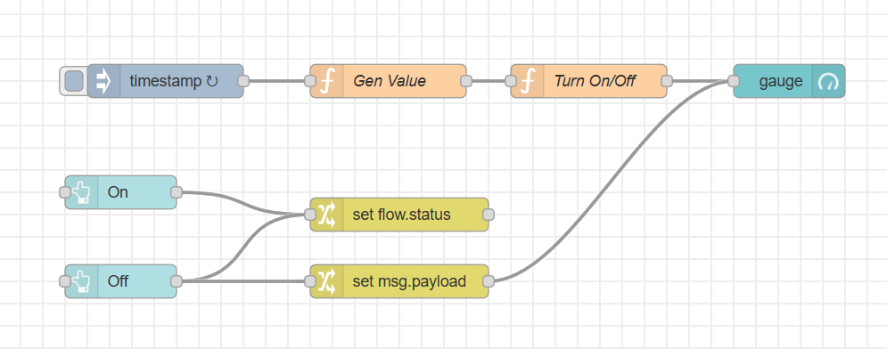
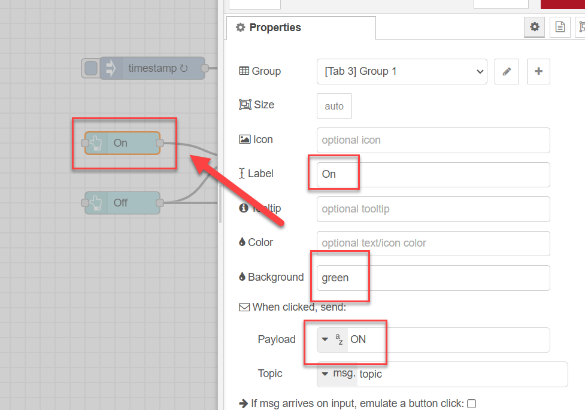
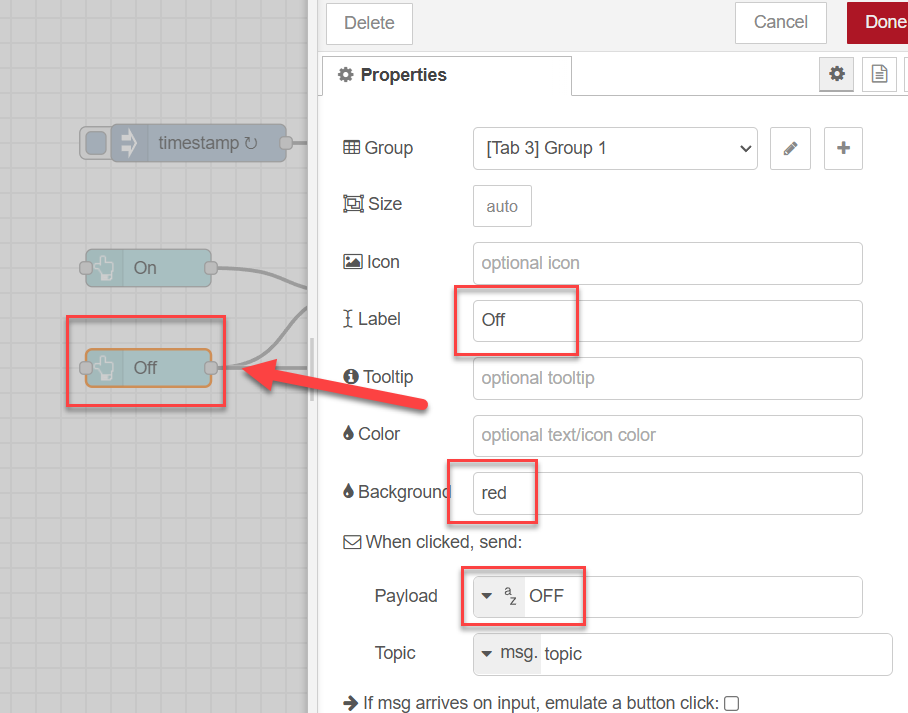

<style>
@import url('https://fonts.googleapis.com/css2?family=Prompt:ital,wght@0,100;0,300;0,400;0,700;1,100;1,300;1,400;1,700&display=swap');

    :root {
    font-family: Prompt;
    --hl-color: #D57E7E;
}
h1 {
  font-family: Prompt
}
</style>

# Production Supporting Systems in Factories

## ระบบสนับสนุนการผลิตในโรงงานอุตสาหกรรม

---

# Context

---

# Scope

The `scope` of a particular context value.

- `Node` - only visible to the node that set the value
- `Flow` - visible to all nodes on the same flow (or tab in the editor)
- `Global` - visible to all nodes

---

## Use `flow` context to pass values

---



---

# Upper `inject` node


---

# `function` node

```js
msg.payload = Math.random();
return msg;
```

---

# `change` node

## 

---

# Lower `inject` node

## 

---

# Side note

- You can use `MQTT` protocol to pass "context" information.
  - This is actually a better way.

## 

---

# Using code

## 

---

### `Set Flow Value` node

```js
flow.set("value", msg.payload);
```

### `Get Flow Value` node

```js
const value = flow.get("value") ?? 0;
msg.payload = value;
return msg;
```

---

# Counter with reset button

---

# Flow



---

# `Random Number` (function) node

```js
msg.payload = Math.random();
return msg;
```

---

# `Switch` node

## 

---

# `Set Counter` (Function) node

```js
const curCounter = flow.get("counter") ?? 0;
flow.set("counter", curCounter + 1);
msg.payload = curCounter + 1;
return msg;
```

---

# `button` node

## 

---

# `change` node

## 

---

# Turning sensor display on and off

---

# Flow

## 

---

# `Gen Value` node

- Testing

```js
msg.payload = Math.random();
return msg;
```

- Actual

```js
const status = flow.get("status") ?? "OFF";
if (status === "ON") {
  msg.payload = Math.random();
  return msg;
} else {
  // Do nothing for now.
}
```

---

# ON button

## 

---

# OFF button

## 

---

# Change node

## 
