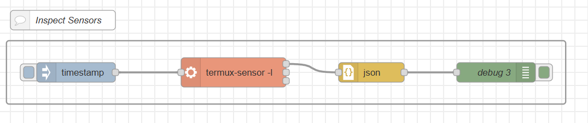
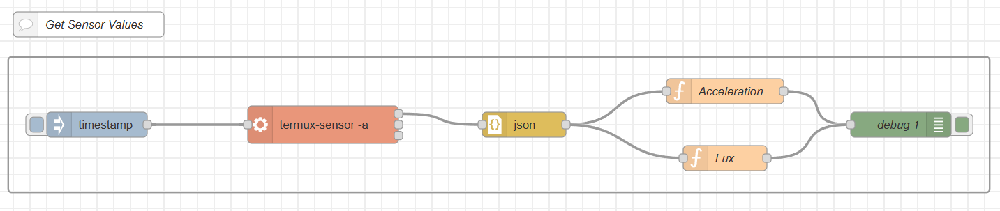
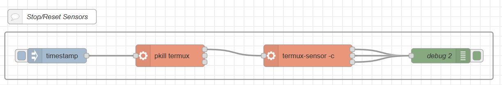
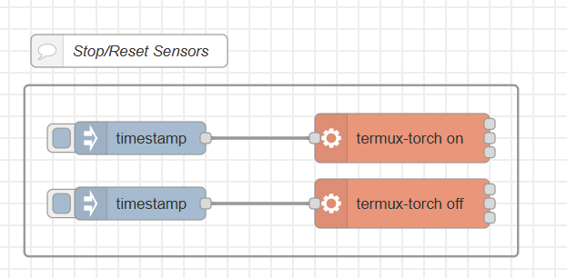

<style>
@import url('https://fonts.googleapis.com/css2?family=Prompt:ital,wght@0,100;0,300;0,400;0,700;1,100;1,300;1,400;1,700&display=swap');

    :root {
    font-family: Prompt;
    --hl-color: #D57E7E;
}
h1 {
  font-family: Prompt
}
</style>

# Production Supporting Systems in Factories

## ระบบสนับสนุนการผลิตในโรงงานอุตสาหกรรม

---

# Mobile Sensor

> Android only, no iPhone, sorry

---

# Install `F Droid` / `termux`

- Install `F Droid`
  - Goto https://f-droid.org
  - Install F-Droid
- Install software from `F-Droid`
  - Install `termux`
  - Install `termux:API`

---

# Install `node-red`

- In `termux` window
  - ⌨️ `apt update`
  - ⌨️ `apt upgrade`
  - ⌨️ `pkg install termux-api`
  - ⌨️ `pkg install coreutils nodejs`
- Install `node-red`
  - ⌨️ `npm install -g pnpm`
  - ⌨️ `pnpm setup` _(ให้ปิดแบบ Exit แล้วเปิดใหม่)_
  - ⌨️ `pnpm install -g node-red`

---

# Start `node-red`

- In `termux` window
  - ⌨️ `node-red`

---

# Misc

- See ip address of mobile phone from `termux`
  - ⌨️ `ifconfig`
- Test connection from `powershell`
  - ⌨️ `test-netconnection x.x.x.x -port 1880`

---

# Sensors

- ⌨️ `termux-sensor -l`
- ⌨️ `termux-sensor -s <<Sensor Name>>`
- ⌨️ `termux-sensor -a` _(all sensors)_
- ⌨️ `termux-sensor -c` _(clean up)_

---

# Flashlight

- ⌨️ `termux-torch on`
- ⌨️ `termux-torch off`

---

# Inspecting sensors



---

# Obtaining sensor values



---

# `function` node (Acceleration)

```js
const sensor_name = "LSM6DSO Acceleration Sensor"; // Change here
const payload = msg.payload;
const values = payload[sensor_name].values;
const output_value = Math.sqrt(
  values[0] ** 2 + values[1] ** 2 + values[2] ** 2
); // Modify here
msg.payload = output_value;
return msg;
```

---

# `function` node (Lux)

```js
const sensor_name = "TMD4910 Uncalibrated lux Sensor"; // Change here
const payload = msg.payload;
const values = payload[sensor_name].values;
const output = values[0]; // Modify here
msg.payload = output;
return msg;
```

---

# Resetting/stopping sensors



---

# Controlling flashlight


