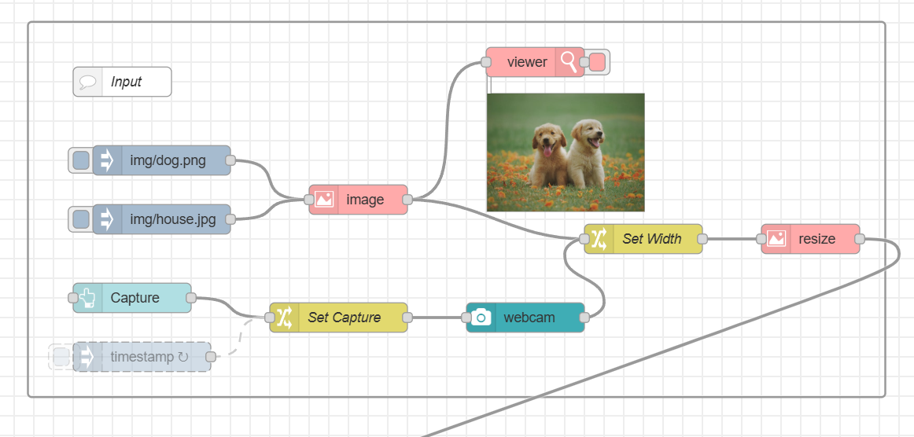
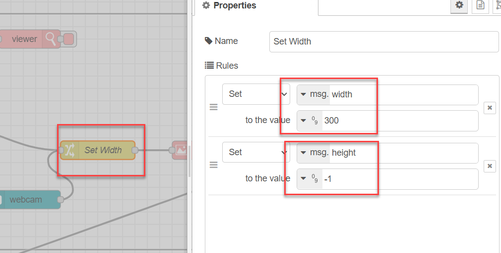
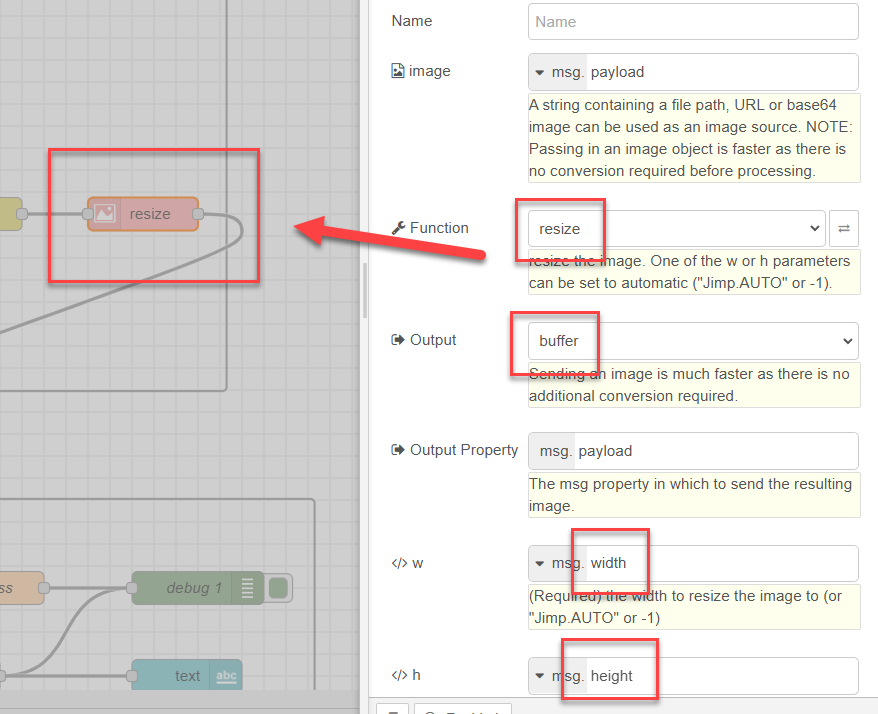
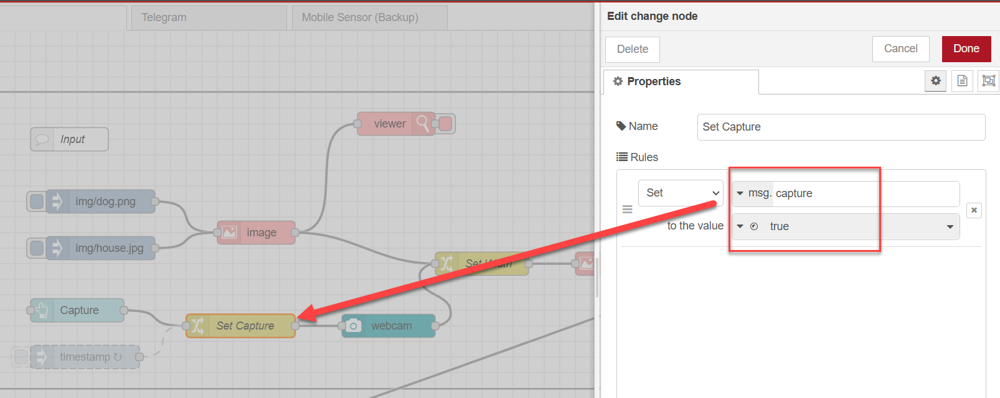
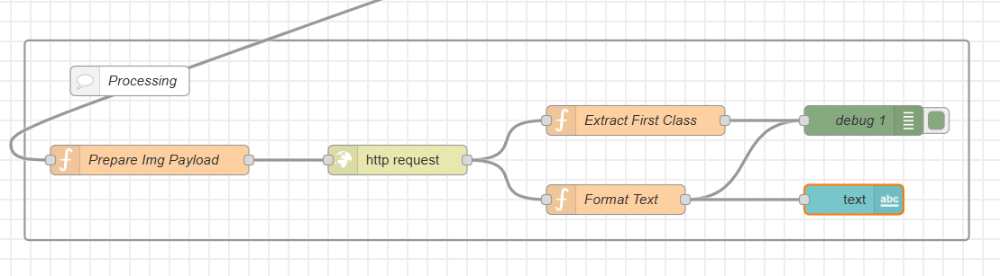

<style>
@import url('https://fonts.googleapis.com/css2?family=Prompt:ital,wght@0,100;0,300;0,400;0,700;1,100;1,300;1,400;1,700&display=swap');

    :root {
    font-family: Prompt;
    --hl-color: #D57E7E;
}
h1 {
  font-family: Prompt
}
</style>

# Production Supporting Systems in Factories

## ระบบสนับสนุนการผลิตในโรงงานอุตสาหกรรม

---

# Machine learning

> Image classification

---

# Setting up ML server

- Get [code](https://github.com/prodsup-67/ml-express)
- `pnpm install`
- `pnpm run build`
- `pnpm run start`
- Test if server is running.
  - http://localhost:3003

---

# Preparing `node-red`

- `pnpm install node-red-contrib-image-tools node-red-node-ui-webcam node-red-dashboard`

---

# Image input flow



---


---



---



---

## 

---

# Image processing flow



---

# `function` node (Prepare Img Payload)

```js
msg.payload = { imageEncoded: Buffer.from(msg.payload).toString("base64") };
msg.headers = { "Content-Type": "application/x-www-form-urlencoded" };
msg.url = "http://localhost:3003/upload_base64";
return msg;
```

---

# `function` node (Extract First Class)

```js
const obj = JSON.parse(msg.payload);
msg.payload = obj.predictions[0].class;
return msg;
```

---

# `function` node (Format Text)

```js
const obj = JSON.parse(msg.payload);
let textOut = "";
for (const pred of obj.predictions) {
  const classStr = pred.class;
  const score = pred.score;
  const scoreP = (score * 100).toFixed(1);
  textOut += `👉${classStr} (${scoreP}%) <br/>`;
}
const dt = new Date();
const datestring = dt.toLocaleDateString();
const timestring = dt.toLocaleTimeString();
textOut += `<br/>📆${datestring} ⏰${timestring}`;
msg.payload = textOut;
return msg;
```

---

# Train your own model

- [Teachable machine](https://teachablemachine.withgoogle.com/)
