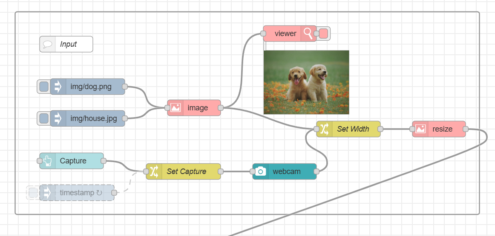
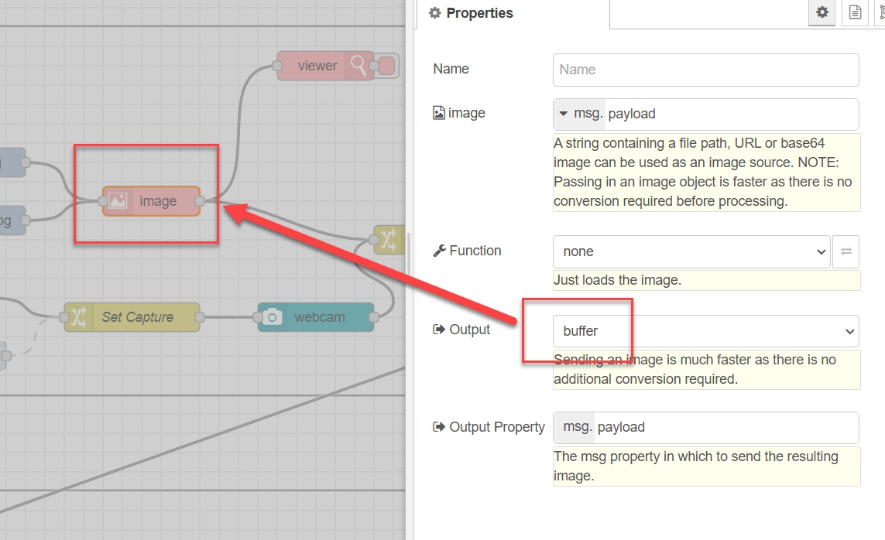
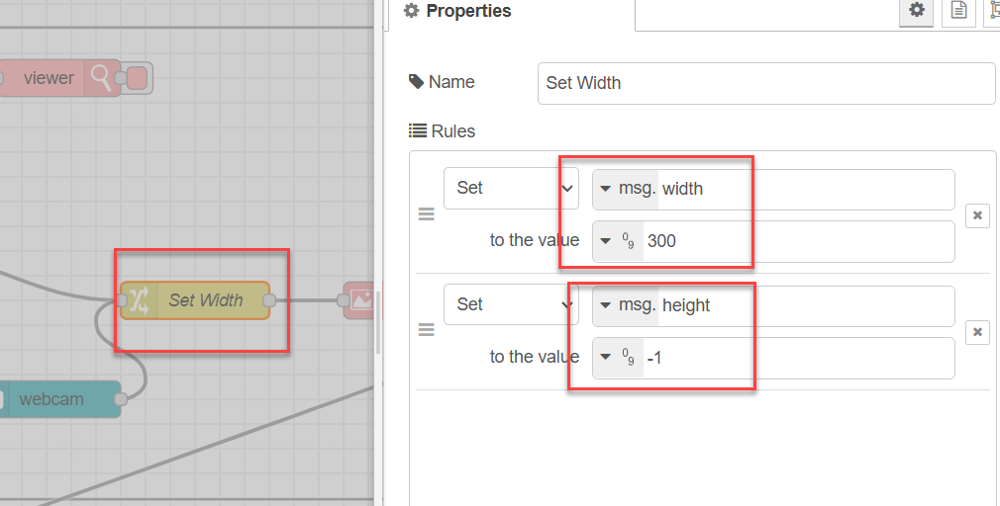
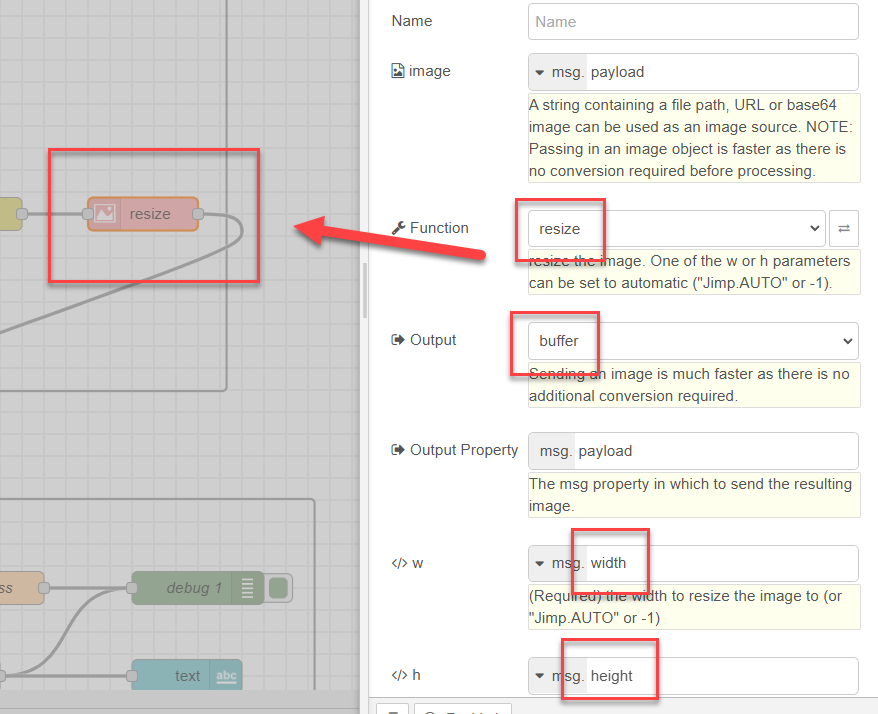
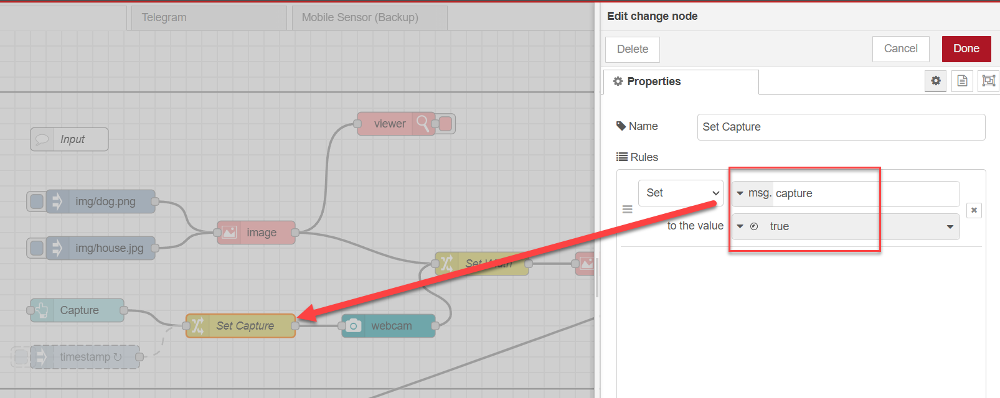

# Production Supporting Systems in Factories

## ระบบสนับสนุนการผลิตในโรงงานอุตสาหกรรม

---

# Setting up ML server

- Get [code](https://github.com/prodsup-67/ml-express)
- `pnpm install`
- `pnpm run build`
- `pnpm run start`
- Test if server is running.
  - http://localhost:3003

---

# Preparing `node-red`

- `pnpm install node-red-contrib-image-tools node-red-node-ui-webcam node-red-dashboard`

---

# Image input flow

---

---

---

---

