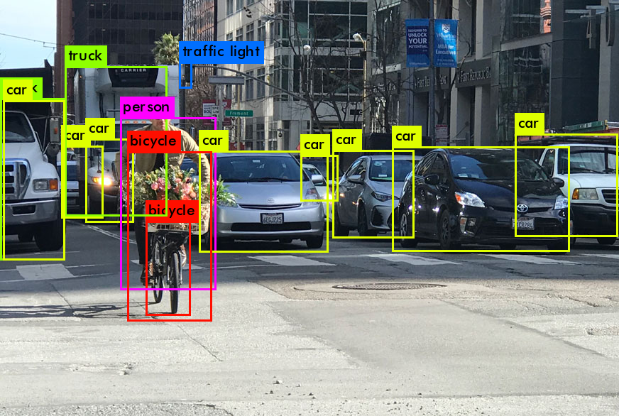
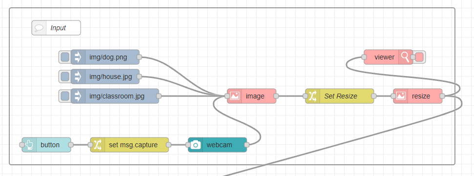
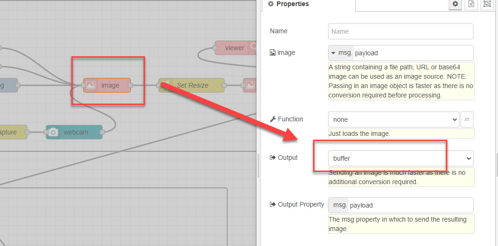
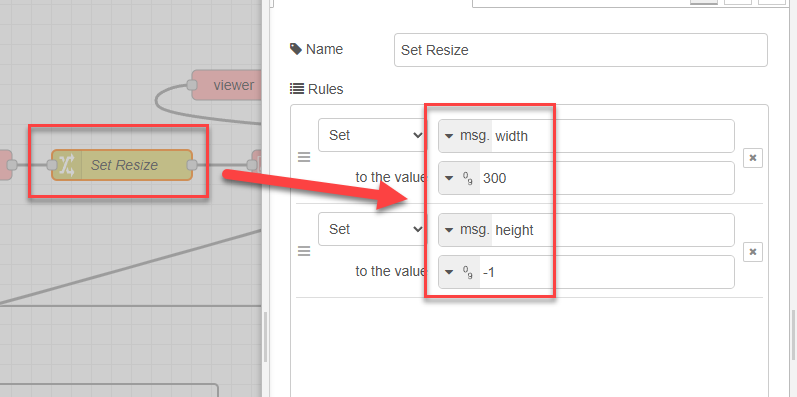
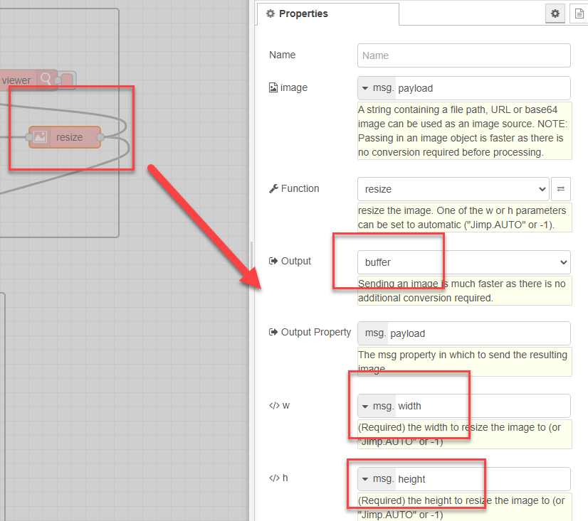
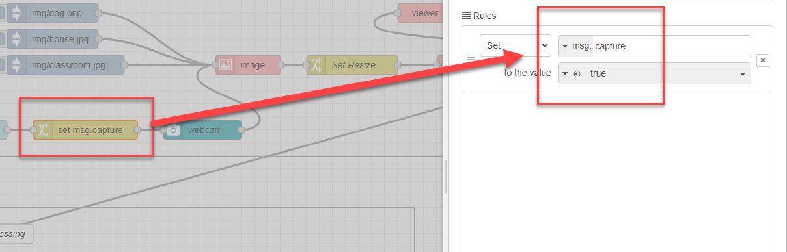
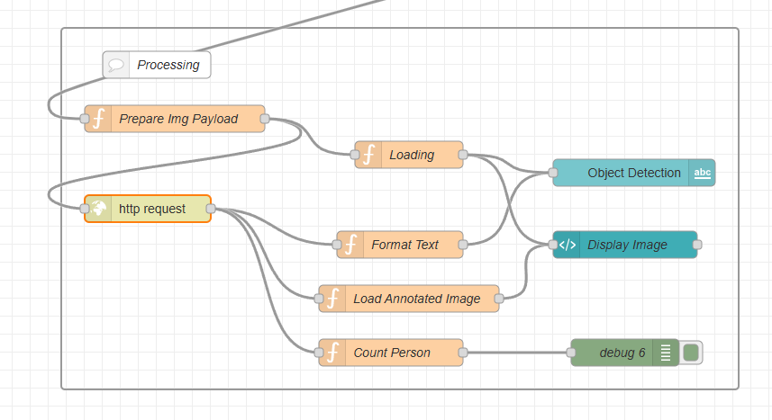
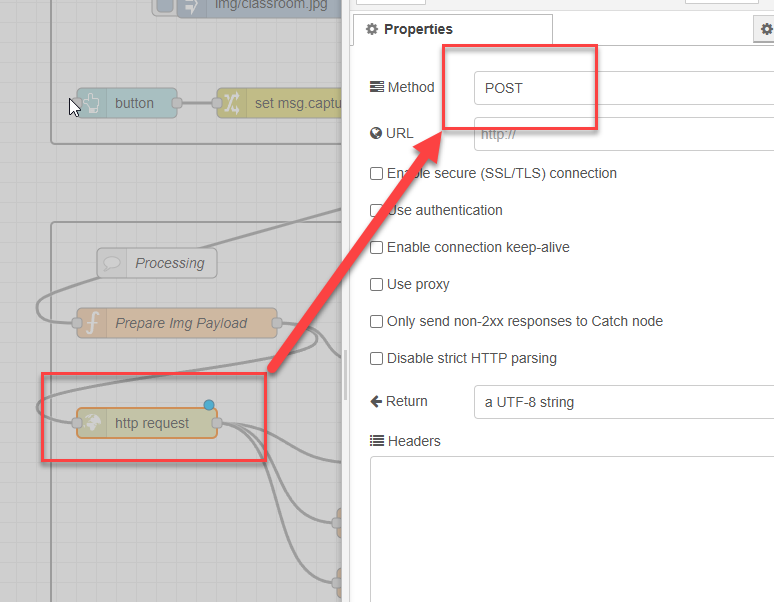

<style>
@import url('https://fonts.googleapis.com/css2?family=Prompt:ital,wght@0,100;0,300;0,400;0,700;1,100;1,300;1,400;1,700&display=swap');

    :root {
    font-family: Prompt;
    --hl-color: #D57E7E;
}
h1 {
  font-family: Prompt
}
</style>

# Production Supporting Systems in Factories

## ระบบสนับสนุนการผลิตในโรงงานอุตสาหกรรม

---

# Machine learning

> Object Detection

---

# Object detection



- Car
  - Top: 500, Bottom: 200, Left: 50, right: 400
  - 50%
- Bicycle
  - ...
  - ...

---

# COCO dataset

- _Common Objects in Context_
- Large-scale image recognition dataset for object detection, segmentation, and captioning tasks.
  - Contains over 330,000 images.
  - Annotated with 80 object categories.
- https://cocodataset.org/#explore

---

# COCO SSD

- This model detects objects defined in the COCO dataset.
- Uses SSD algorithm
- [Source](https://github.com/tensorflow/tfjs-models/tree/master/coco-ssd)
- [Classes](https://github.com/tensorflow/tfjs-models/blob/master/coco-ssd/src/classes.ts)

---

# Setting up ML server

- Get [code](https://github.com/prodsup-67/obj-detection-express)
- `pnpm install`
- `pnpm run build`
- `pnpm run start`
- Test if server is running.
  - http://localhost:3004

---

# Preparing `node-red`

- `pnpm install node-red-contrib-image-tools node-red-node-ui-webcam node-red-dashboard`

---

# Input flow

---



---



---



---



---



---

# Processing flow

---



---

# `Prepare Img Payload` function node

```js
msg.payload = { imageEncoded: Buffer.from(msg.payload).toString("base64") };
msg.headers = { "Content-Type": "application/x-www-form-urlencoded" };
msg.url = "http://localhost:3004/upload_base64";
return msg;
```

---



---

# `Format Text` function node

```js
const obj = JSON.parse(msg.payload);
let textOut = "";
for (const pred of obj.countsArr) {
  const classStr = pred.class;
  const count = pred.count;
  textOut += `👉${classStr} (x${count}) <br/>`;
}
if (!textOut) textOut = "<center><i>No Object Detected</i></center><br/>";
const dt = new Date();
const datestring = dt.toLocaleDateString();
const timestring = dt.toLocaleTimeString();
textOut += `<br/>📆${datestring} ⏰${timestring}`;
msg.payload = textOut;
return msg;
```

---

# `Load Annotated Image` function node

```js
const obj = JSON.parse(msg.payload);
const imageURL = obj.imageURL;
const html = ``;
msg.payload = html;
return msg;
```

---

# `Count Person` function node

```js
// Select class here
const selectClass = "person";
// Code
const obj = JSON.parse(msg.payload);
msg.payload = obj.countsObj?.[selectClass] ?? 0;
return msg;
```

---

# `Loading` function node

```js
const html = `<center>Loading...</center>`;
msg.payload = html;
return msg;
```
