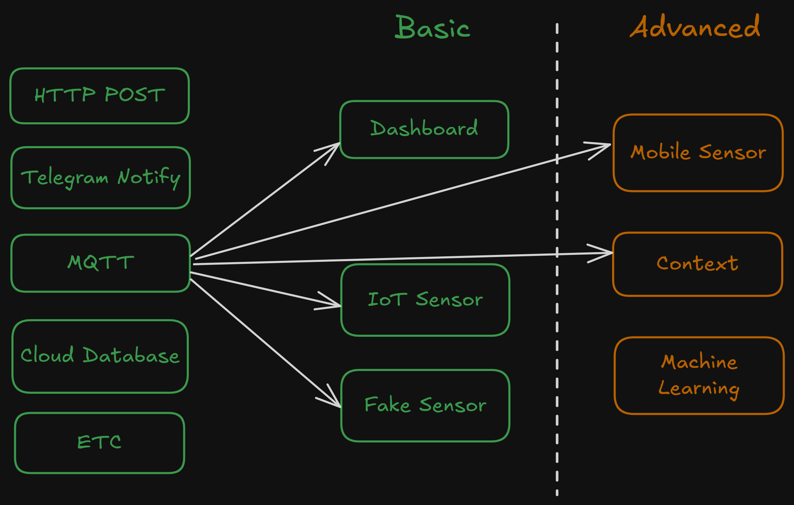

# Production Supporting Systems in Factories

## ระบบสนับสนุนการผลิตในโรงงานอุตสาหกรรม

---

# Project

---

# Previous year

- Temperature monitoring system
- Room usage monitoring system (brightness sensor)
- Automatic Light control system
- Smart secuity system (face detection)
- Quality control system (image classification)
- [More](https://www.youtube.com/playlist?list=PLNGLpHQhvGrtqn6UYxUYXm7C0auAYrh_O)

---

# Grade

- 20% ของเกรด
- คะแนนเต็ม 35 คะแนน
  - คะแนน Proposal 4 คะแนน
  - คะแนน Content 25 คะแนน
  - คะแนน Presentation 6 คะแนน

---

# Proposal

- เข้ามาคุยกับผมในช่วงเวลา Proposal _(ดู Schedule หน้าถัดไป)_
  - **ไม่มา อด 4 คะแนน**
- คิดหัวข้อมาด้วย
- เอา Laptop ที่จะรัน `node-red` มาให้ผมช่วย Setup
- มารับ IoT sensor

---

# Project content

| คะแนน  | เกณฑ์             | คะแนนย่อย | ตัวอย่าง                 |
| ------ | ----------------- | :-------: | ------------------------ |
| โปรเจค | Monitoring Flow   |     5     | Chart / Gauge / Text     |
|        | Notification Flow |     5     | Telegram Notify          |
|        | Control Flow      |     5     | Action Button            |
|        | Data Storage      |     5     | Firebase read/write      |
|        | Logic Design      |     5     | Overall logic complexity |

---

# Preject presentation

| คะแนน  | เกณฑ์                | คะแนนย่อย |
| ------ | -------------------- | :-------: |
| นำเสนอ | Slide                |     3     |
|        | Presenting / demoing |     3     |

- มา Present ในช่วงเวลา Present _(ดู Schedule หน้าถัดไป)_
- **นำเสนอกลุ่มละไม่เกิน 10 นาที**
- แนะนำให้อัด VDO แทนการ Demo Live
- แต่เอา Laptop มาให้ดูงานด้วย

---

# Schedule (Sec 001/004)

| ช่วงเวลา     | วัน             |
| ------------ | --------------- |
| Proposal     | 27 Jan - 7 Feb  |
| Presentation | 10 Feb - 21 Feb |

- Location @ Office ของ อ.นิรันดร์
- นัดผ่าน [Calendly](https://calendly.com/nirand-p/prodsup-presentation)
  - สามารถนัดให้ช่วยเหลือเพิ่มเติมได้

---

# Schedule (Sec 002/005)

| ช่วงเวลา     | วัน             |
| ------------ | --------------- |
| Proposal     | 24 Feb - 28 Feb |
| Presentation | 3 Mar - 7 Mar   |

- Location @ Office ของ อ.นิรันดร์
- นัดผ่าน [Calendly](https://calendly.com/nirand-p/prodsup-meeting-presentation-sec-2-5)
  - สามารถนัดให้ช่วยเหลือเพิ่มเติมได้

---

# My Office

IE Build First Floor

---

# Slide

- ชื่อกลุ่ม
- ระบบมีความสามารถอะไรในหัวข้อต่อไปนี้
  - Monitoring
  - Notification
  - Control
  - Data storage
- อธิบายการทำงานของ Flow ต่างๆ
  - ใช้ Diagram จะดีกว่า Screencap `node-red`
- สามารถต่อยอดไปทำอะไรในโรงงานได้

---

# Roadmap

